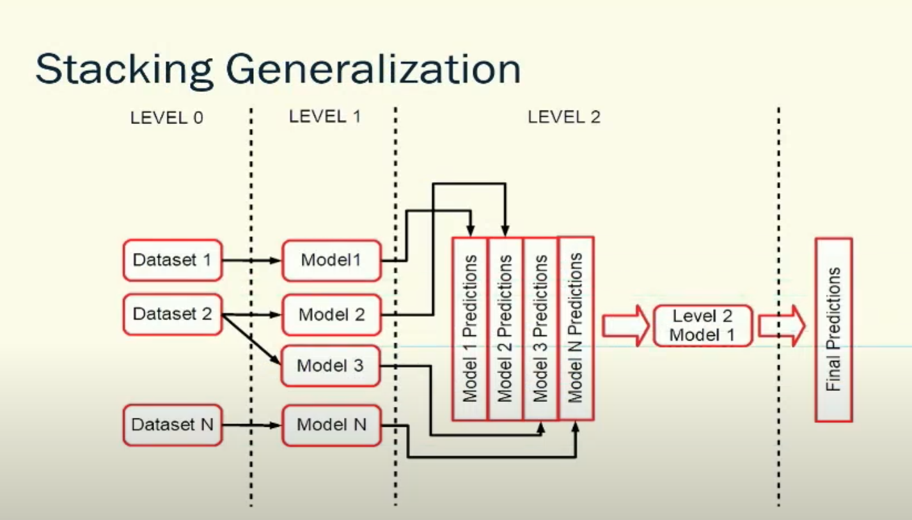
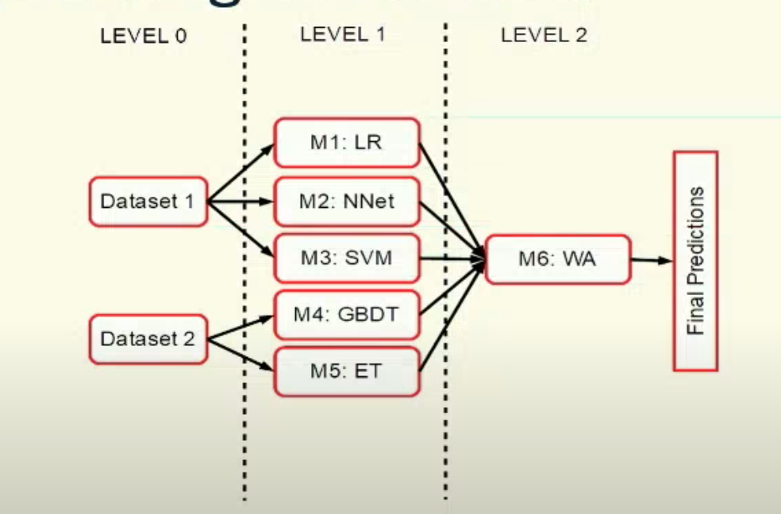
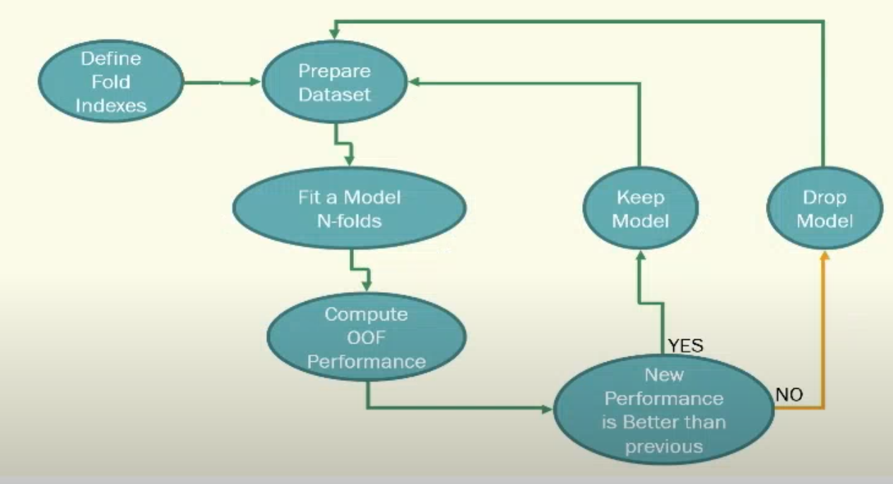
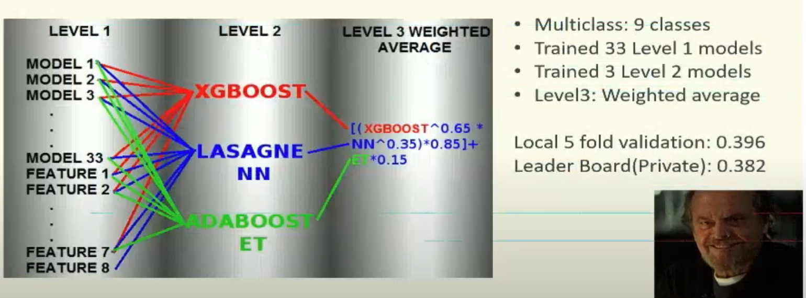

# 
 Stacking Strategies by GIBA 
  

ref: <a href=https://www.youtube.com/watch?v=9oR7F0CfcZY&t=1680s>link</a>
  
  

## Diversity
* **Dataset**(Feature Engineering)
    * ***Cleaning Data***: drop outliers, clip features and labels, drop features, classify numeric and categorical features, sub sample, over sample...
    * ***Categorical features***: One Hot Encoding, frequency encoding, ordinal encoding, entity embeddings, target encoding, embeddings, target encoding(likelihood encoding), dimension reduction, combining two or more categorical in one feature...
    * ***Numerical features***: missing values imputations, bucketing, clustering, monotonic transform, linear combination of N features, evolutionary algorithms...
    * ***Text***: tokenization and attention are all you need
    * ***Images***: augmentaion, extract features using pretrained CNNs. Statistical features based on color channels, brightness, blurriness, aspect ratio
* **Training Algorithms**
    * ***GBDT***
    * ***NN***
    * ***SVM***
    * ***DT***
    * ***FM***
    * ***LR***
    * ***LoR***
    * ***NB***
    * ***KNN***
    * ***Vowpal Wabbit***
* **Approach**: team up!
* **Target Transformation**(in Regression problems, log(x), 1/x)
* **Stacking Architectures**

## Cross-Validation
* Define the folds
* Time series need to be splitted based on time
* Use the same indexes to train and tune all level models

## Stacking Workflow

## Improving Stacking Performance
* Feature Engineering Never Giveup
* Fine-Tune Level 1 models hyperparameters to the limit
* Bagging(average multiple runs subsampling and changing the initial seed)
* Keep track of previous results and offline experiments
* Keep track of how much time your models takes to run. It can be a strategic decision to train new models
* Don't tune too much Level2 models and above
* Keep track of your stacking final performance. Sometimes a new model don't improve the performance. Not enough Diversity.

## Tips
* Save a text file containing row id and fold indexes to be used for cross-validation
* Define a pattern for models filename
* If adding one model to your stacking improves x% of your CV score, you should expect the same improvements in Kaggle Public LB. If it doesn't hold true, something went wrong.
* Low Correlation == High Diversity
* Check for anomaly in both train and test Level 1 predictions: anomaly matrix: abs(cor(train_stacked)-cor(test_stacked))

## Example

